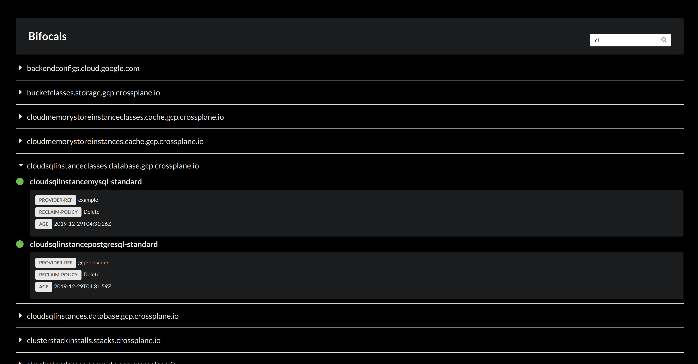

# Bifocals



## Deploy

To deploy Bifocals into your Kubernetes cluster, execute the following commands:

```
kubectl create namespace bifocals
kubectl -n bifocals apply -f https://raw.githubusercontent.com/crdsdev/bifocals/master/deploy/manifests/install.yaml
```

If you want to use the dashboard locally:

```
kubectl port-forward svc/bifocals -n bifocals 8080:80
```

**NOT RECOMMENDED**

If you want to publicly expose your dashboard, you will need to change the bifocals `Service` type from `ClusterIP` to `LoadBalancer`.
